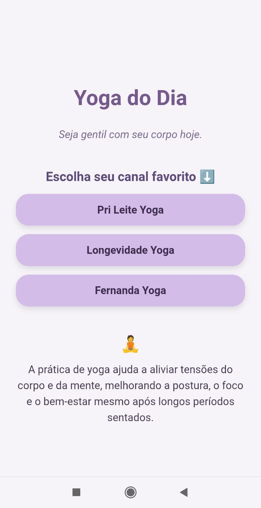
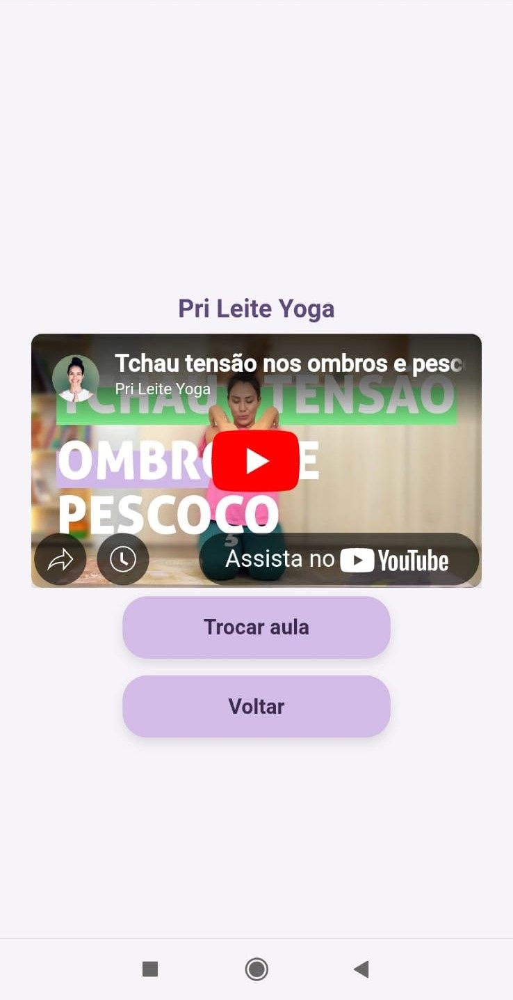

# 🧘 Yoga Todo Dia

**Yoga Todo Dia** é um projeto web responsivo que oferece sugestões rápidas de aulas de yoga diretamente do YouTube. Criado para quem passa muitas horas sentado e quer aliviar dores nas costas, pescoço e quadril, o app propõe uma prática diária com foco em bem-estar, mobilidade e autocuidado.

## 💡 Sobre o projeto

A ideia surgiu da minha própria experiência com dores por ficar muito tempo sentada programando. Como praticante de yoga há 5 anos, sei que 10 a 15 minutos por dia fazem toda a diferença. Por isso, selecionei aulas curtas dos meus canais favoritos do YouTube e desenvolvi uma aplicação leve, funcional e com cara de app para celular.

## 🛠️ Tecnologias e recursos utilizados

- **HTML5 semântico**: estrutura limpa e organizada;
- **CSS3 com responsividade mobile-first**: layout adaptável a diferentes tamanhos de tela, com foco em UX e estética inspirada em aplicativos;
- **JavaScript Vanilla**:
  - Lógica para sorteio aleatório de frases motivacionais;
  - Seleção de vídeos por canal;
  - Uso de `embed` para os vídeos serem exibidos diretamente na página;
  - Embaralhamento de vídeos sem repetição;
  - Navegação entre telas simulando SPA simples;
- **Controle de exibição com classes CSS (`.hidden`)**;
- **Manipulação de DOM e funções reutilizáveis**.

## 🚀 Aprendizados

- Estruturação de uma aplicação modular com navegação entre “telas” em uma mesma página;
- Uso de array, funções e métodos como `.sort()`, `.shift()`, `.includes()`;
- Boas práticas de UX/UI em projetos front-end.

## 🔗 Acesse o projeto

👉 [Yoga Todo Dia - GitHub Pages](https://tsantosale.github.io/yoga-do-dia/)

---

## 📸 Demonstração

